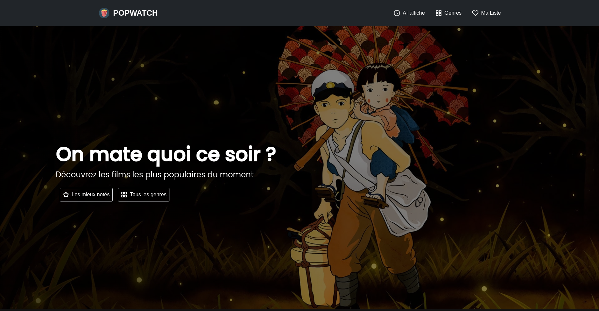
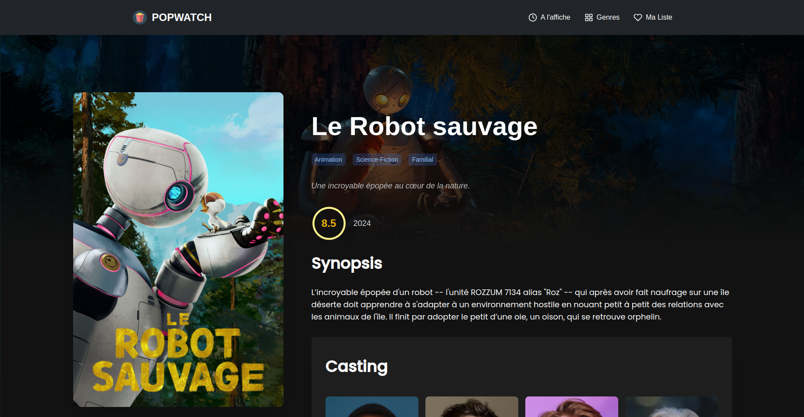

## Popwatch
# By Louis with ❤️

Popwatch est une application web réalisée avec NextJS et Tailwind à l'aide de l'API de [The Movie Database](https://www.themoviedb.org/).
Finies les soirées où on ne sait pas quoi regarder, Popwatch vous propose une sélection de films et de séries les mieux notées.

Envie de rire ? De pleurer ? De frissonner ? Triez par genre pour trouver le film parfait pour votre mood de la journée.

## Installation

1. Clonez le projet
2. Installez les dépendances avec `npm install`
3. Créez un fichier `.env` à la racine du projet et ajoutez-y votre clé API comme ceci : `NEXT_PUBLIC_API_KEY=VOTRE_CLE_API`
4. Lancez le projet avec `npm run dev`
5. Rendez-vous sur `http://localhost:3000`

Inspiré de [MovieScope](https://www.moviescope.site/)